# Lab 2 — Meet the OS You Will Build

## Build environment and boot

The setup screenshot shows `/usr/bin/riscv64-linux-gnu-gcc`, QEMU 10.2.1, and the xv6 source tree. `user/user.h` declares `int pause(int);` at line 25. This checkout therefore requires `pause()` where the handout's example uses `sleep()`.

`make qemu` launches xv6, which prints `xv6 kernel is booting`, starts additional harts, and runs `init: starting sh` before displaying its shell prompt. The boot screenshot demonstrates the existing image starting successfully; the final test screenshot also demonstrates execution of the added sleep program. Compilation output is not included in that final capture.

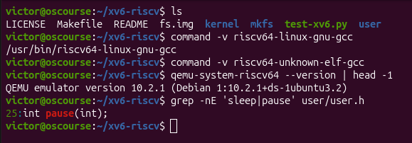
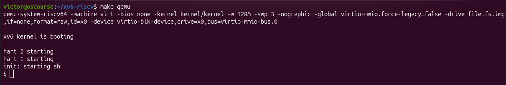

## Part 2 — Using xv6

### Three included programs

`ls` lists directory entries, `cat` reads file contents, and `echo` prints arguments. All three are visible in the xv6 directory listing.

### OS features needed for a pipe

A shell pipeline needs process creation/execution and interprocess communication. The shell can start separate processes using `fork` and `exec`; a kernel pipe carries bytes between them, with file descriptors connecting the first program's standard output to the second program's standard input.

The captured `ls | grep c` output contains `cat`, `echo`, `wc`, `sync`, and `console`. `wc README` prints `48 336 2441 README`: 48 lines, 336 words, and 2441 bytes.

### Comparison with the Linux shell

The xv6 shell supports familiar command execution and pipes, but provides a much smaller set of conveniences than the Linux shell used in Lab 1.

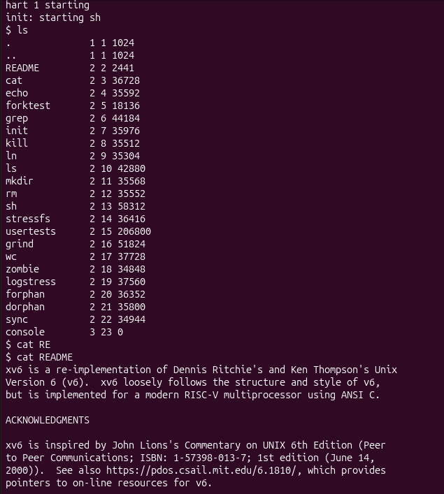
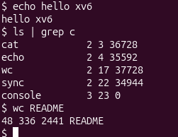

## Part 3 — Reading source

### System calls used by user/cat.c

| System call | What it requests |
| --- | --- |
| `open` | Open an input pathname for reading and obtain a file descriptor. |
| `read` | Read bytes from the input descriptor into a userspace buffer. |
| `write` | Write those bytes to standard output, descriptor 1. |
| `close` | Release an opened file descriptor. |
| `exit` | Terminate the process with a success or error status. |

`fprintf` is a userspace formatting function, not itself a system call; its output ultimately uses `write`. With no filename arguments, `cat` reads standard input, descriptor 0.

### Location of sys_read

In the captured checkout, `sys_read(void)` is at **line 69 of `kernel/sysfile.c`**; its return type is on line 68. It obtains syscall arguments, checks the file descriptor, and calls `fileread`. `sys_write(void)` is at line 83. These line numbers describe the captured version and may differ in other revisions.

### Kernel versus user code

`kernel/` contains privileged OS code that controls resources and implements system calls, while `user/` contains ordinary programs that request those services through the system-call interface.

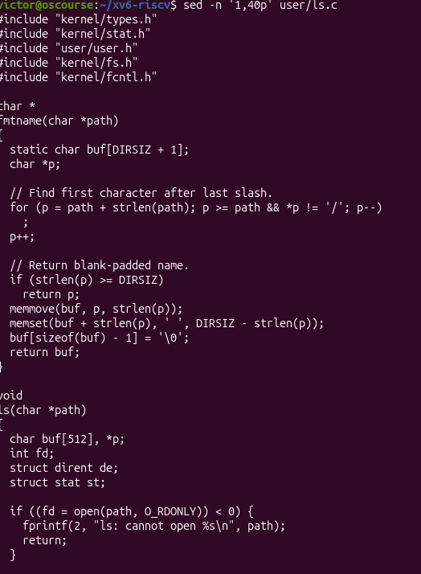
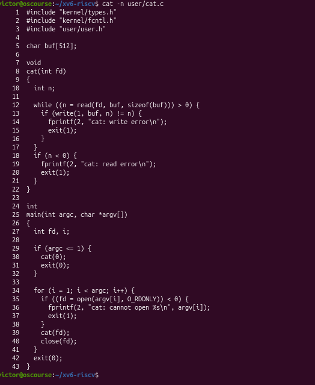
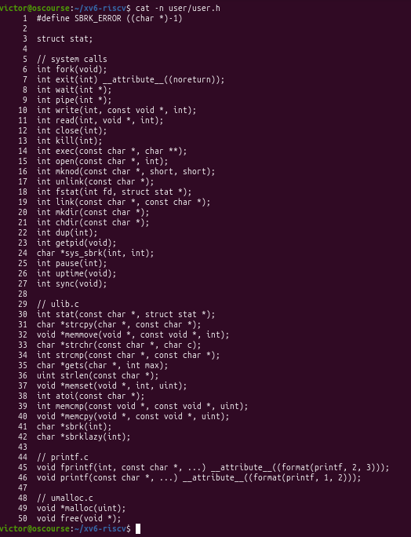
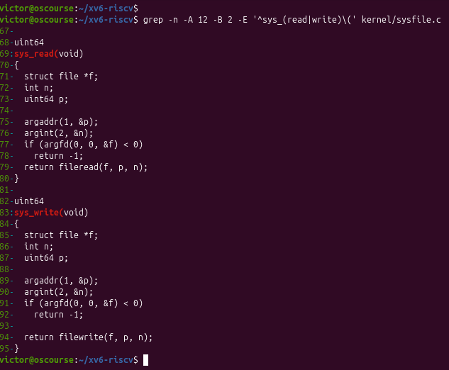

## Part 4 — The sleep program

[The included source](user/sleep.c) is transcribed from `L2_09_sleep_code.png`. It requires exactly one argument, prints a usage message to standard error and exits with status 1 otherwise, converts the argument using `atoi`, calls `pause`, and exits with status 0. The executable remains named `sleep`.

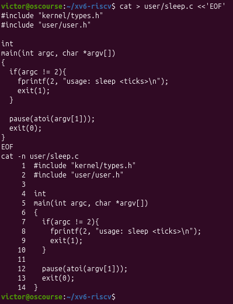

The Makefile capture adds `$U/_sleep\` to `UPROGS`, but removes the blank line before `fs.img:`. Because the last entry ends with a continuation backslash, that separator must be restored. [Makefile.patch](Makefile.patch) records the intended change against an unmodified matching Makefile, including the separator.

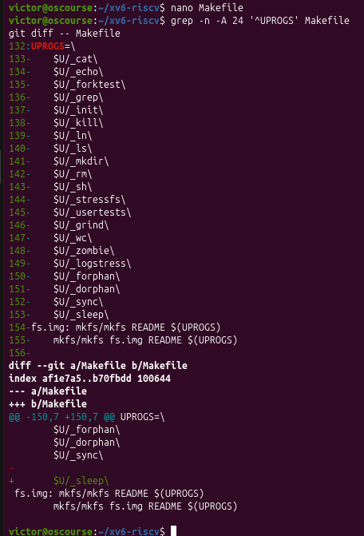

### Captured runtime validation

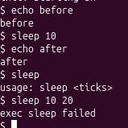

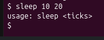

The runtime screenshots show:

| Command | Observed result |
| --- | --- |
| `echo before` | Prints `before`. |
| `sleep 10` | Returns to the shell without an error message. |
| `echo after` | Prints `after`. |
| `sleep` | Prints `usage: sleep <ticks>`, confirming the no-argument check. |
| `sleep 10 20` | The follow-up `fixed2.png` shows `usage: sleep <ticks>`, confirming the extra-argument check. |

The follow-up confirms the expected extra-argument behavior. The earlier capture recorded `exec sleep failed` for the same command; its cause was not established, but the repeated check now succeeds. Both invalid argument counts produce the usage message, matching the supplied source's `argc != 2` check. The screenshot demonstrates that the custom executable can run, but does not measure its pause duration or show its exit status. The earlier Makefile screenshot still depicts the edit before restoring the blank separator; the supplied patch records the correct layout. The full xv6 source tree and actual VM Makefile were not supplied, so this repository does not claim a local build test.
