# Lab 1 — The OS as a Resource Manager

## Environment

The VM username is `victor`, hostname `oscourse`, and kernel `7.0.0-34-generic` on x86-64. The first capture shows seven minutes of uptime. Measurements below are individual snapshots from different sessions, not simultaneous readings.

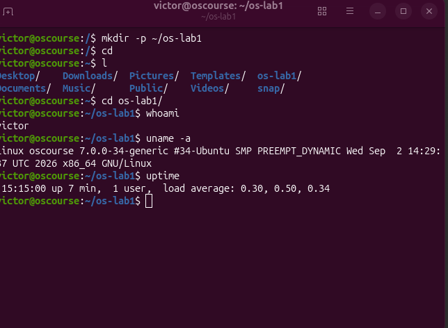

## 1. Files and directories

The files belong to user `victor` and group `victor`. Creating `note.txt`, copying it, and renaming the copy produced two 24-byte files. Removing `renamed.txt` left only `note.txt`, containing `hello operating systems`.

After `chmod 600 note.txt`, the mode is `-rw-------`. The first character identifies a regular file; the next three give the owner read and write permission without execute permission; the remaining two groups of three give the group and other users no permissions. `chmod 644` restores `-rw-r--r--`.

Two directories directly beneath `/` are `/etc`, containing system configuration, and `/home`, containing users' home directories. The screenshots show an `/etc` listing and the path `/home/victor/os-lab1`; a direct `ls -la /` listing was not captured.

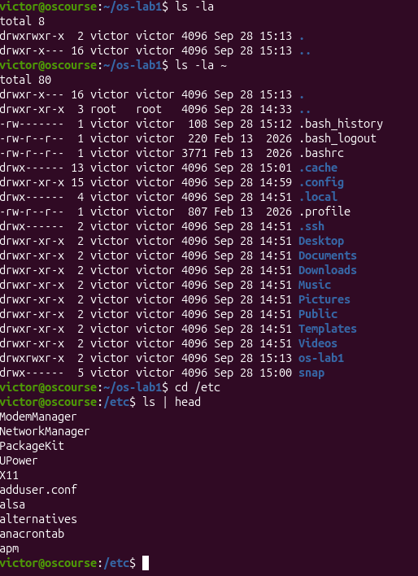
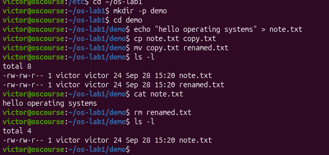
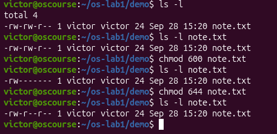

## 2. Processes

PID 1 is `systemd`, shown running as root from `/usr/lib/systemd/systemd`. It is the initial userspace process and manages system services.

The process snapshot contains approximately 222 processes: `ps aux | wc -l` prints 223 including its header, while `ps -e --no-headers | wc -l` prints 222. Counts can change while commands run. A later `top` snapshot shows 251 tasks, with one running and 250 sleeping.

The background `sleep 300` process had PID 9453. It appeared in `jobs` and `ps`, then disappeared after `kill`; the final `ps` output has only a header. A separate sleep process with PID 9765 has `State: S (sleeping)` in `/proc/9765/status`, meaning it is in interruptible sleep rather than actively using the CPU.

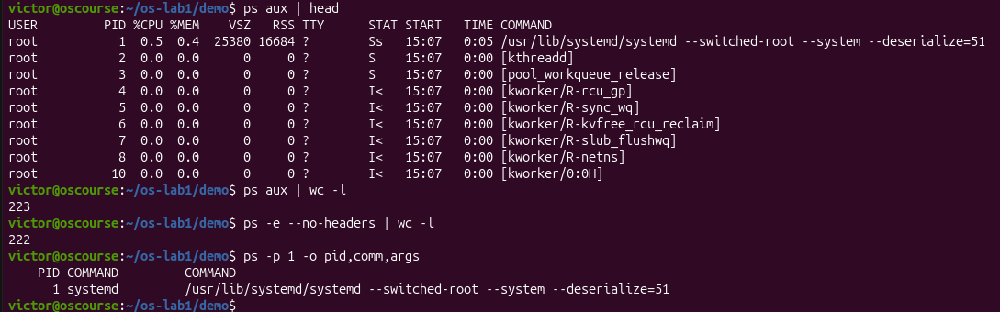
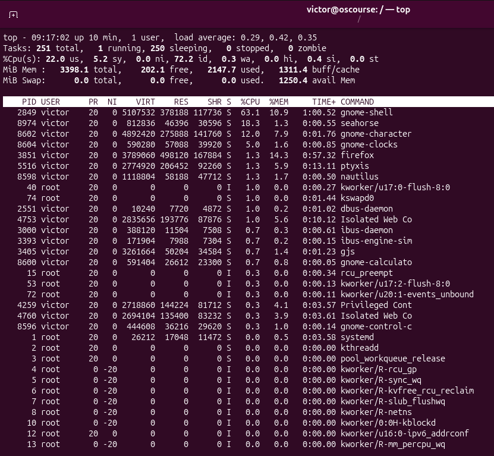
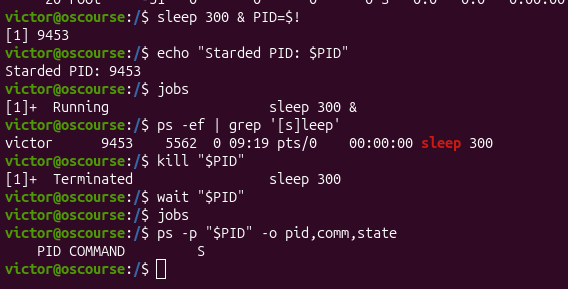
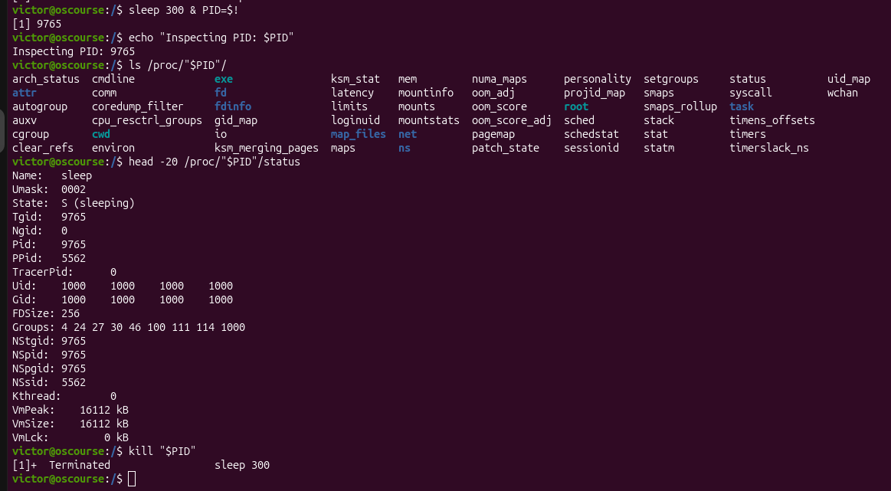

## 3. Memory

`free -h` reports 3.3 GiB total RAM, 2.4 GiB used, 272 MiB free, and 962 MiB available. Available memory includes memory the kernel can reclaim, so it differs from completely unused memory. The subsequent `/proc/meminfo` snapshot reports `MemTotal: 3479664 kB`; small differences between readings are expected while the machine runs.

Swap is backing space used to move eligible memory pages out of RAM. This VM reports 0 B of swap, so none is configured in this capture.

The sleep process with PID 9978 has `VmRSS: 7752 kB`, approximately 7.57 MiB of resident memory. Even a simple program needs executable code, stack, runtime data, and potentially shared library pages. RSS includes resident shared pages and is not a measure of exclusively owned memory.

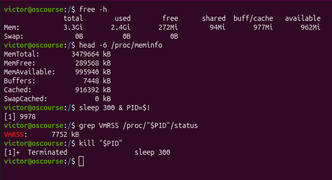

## 4. Devices and storage

The root filesystem `/` is mounted from `/dev/sda2` using ext4, confirmed by `findmnt /`. `df -h` reports a 49 GiB filesystem with 7.5 GiB used, 39 GiB available, and 17% utilization. `lsblk` shows the underlying virtual disk `sda` as 50 GiB. The working directory uses 12 KiB according to `du -sh`.

The `/dev/cdrom` entry points to `sr0`, the VM's virtual optical drive; the storage screenshot shows the VirtualBox Guest Additions media mounted from `/dev/sr0`. `/dev/null` is also visible as a character device: it discards written data and returns end-of-file when read.

“Everything is a file” means that many OS resources, including devices, expose file-like interfaces that programs access through operations such as opening, reading, and writing.

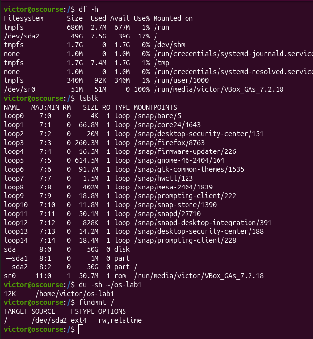
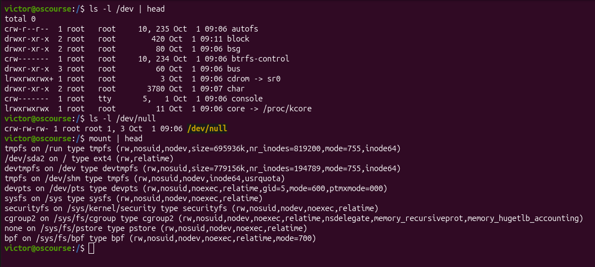

## Closing synthesis

The OS manages files and directories, which I inspected with `ls -l`. It manages processes, visible with `ps`, and memory, visible with `free -h`. It also manages devices and storage, which I inspected with `lsblk`.
